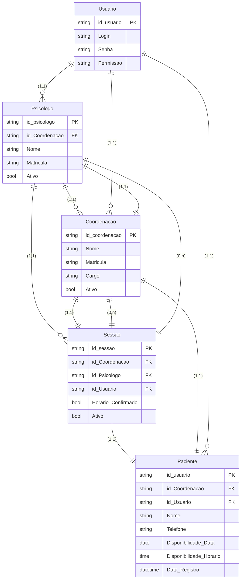

# Projeto_CIS_Rascunhos



# C+S Psicologia

## 💡 Visão Geral do Projeto

### Contexto
Projeto de aplicação web voltado para os alunos de Psicologia da faculdade que estagiam dentro do campus e que ainda utilizam métodos lentos e arcaicos de controle de consulta.

* Ao invés de utilizarem PDFs com extensas listas com informações perdíveis e apagadas, criaremos um sistema de cadastro e disponibilidade.
* O sistema visa permitir que os estagiários selecionem os pacientes com mais eficiência.
* O(A) Coordenador(a) poderá manter um controle mais fácil e acessível dos futuros profissionais e seus pacientes, gerando relatórios mais rápidos.

### 🛠️ Ferramentas Usadas

| Camada | Tecnologia |
| :--- | :--- |
| **Frontend** | React + JavaScript + Tailwind + Vite |
| **Backend** | Java + SpringBoot |
| **Banco de Dados** | MySQL |
| **Autenticação** | Spring Security (a ser implementado) |

---

## 🎯 Objetivos

* Agilizar e aprimorar os processos de agendamento entre pacientes e psicólogos.
* Criar uma ferramenta prática para o dia-a-dia dos estagiários.
* Facilitar a visualização e criação de relatórios para os gestores.

---

## 📋 Especificações (Escopo)

O sistema deve incluir as seguintes funcionalidades:

* **Listagem de Pacientes:** Visualização da lista de pacientes em formato de cartelas (cards).
* **Disponibilidade:** Visualização da disponibilidade de horários também em cartelas.
* **Retorno de Pacientes Cadastrados:** Funcionalidade para buscar pacientes já registrados.
* **Métricas:** Exibição da quantidade de pessoas atendidas.
* **Relatórios:** Controle e facilitação na geração de relatórios para a coordenação.

---

## ⚠️ Problemas Atuais (Resolvidos pelo Projeto)

* A falta de comunicação entre os sistemas utilizado por eles.

## Directory Structure
Frontend:
- `/src`: Código frontend
  - `/components`: Componentes React
  - `/components`: `/calendar`: Calendar components (MonthlyCalendar.jsx, PotentialPatientsGrid.jsx)
  - `/components`: `/common`: Common components (Icons.jsx, PatientDetailSidebar.jsx)
  - `/components`:`/layouts`: Sidebar component (Sidebar.jsx)
  - `/data`: Dados mock (mockData.ts)
  - `/utils`: Definições (dataUtil.js)
  - `/view`: Dashboard overview (DashbooardView.jsx)
 
Backend:
- `/src` : codigo fonte
  - `/controller`: controllers de serviço
  - `/domain`: `/dtos` : todos os Dtos do sistema, dividido em request e response
  - `/domain`: `/dtos` :`/request`: esquemas de dtos de ponto de pedido http (entrada de dados)
  - `/domain`: `/dtos` :`/response`: esquemas de dtos de ponto de pedido http (saida de dados)
  - `/domain`: `/entity` : todos os esquemas de entidades
  - `/infra` : infraestrutura do sistema
  - `/infra`: `/cofig` : configurações e segurança
  - `/infra` : `/mapper` : logica de encapsulamento e transformação de dto(request) para entidade e entidade para dto (response)
  - `/infra` : `/repository` : repositorios das entidades e ponto de acesso ao banco
  - `/infra` : `/service` : camada de interface e implementação das interfaces para encapsular os metodos dos controllers
  - `/infra` : `/validate` : camada de validação para o fluxo de informação


### Limitações Conhecidas
- Não há autenticação de usuário

## Database Schema

| Entidade | Chaves/Atributos | Tipo de Dado | Descrição |
| :--- | :--- | :--- | :--- |
| **Psicologo** | `id_psicologo` (PK), `id_Coordenacao` (FK), `Nome`, `Matricula`, `Ativo` | `string`, `string`, `string`, `string`, `bool` | Profissional responsável pelo atendimento. |
| **Coordenacao** | `id_coordenacao` (PK), `Nome`, `Matricula`, `Cargo`, `Ativo` | `string`, `string`, `string`, `string`, `bool` | Responsável pela gestão/administração. |
| **Sessao** | `id_sessao` (PK), `id_Coordenacao` (FK), `id_Psicologo` (FK), `id_Usuario` (FK), `Horario_Confirmado`, `Ativo` | `string`, `string`, `string`, `string`, `bool`, `bool` | Registro de um agendamento/consulta. |
| **Paciente** | `id_usuario` (PK), `id_Coordenacao` (FK), `id_Usuario` (FK), `Nome`, `Telefone`, `Disponibilidade_Data`, `Disponibilidade_Horario`, `Data_Registro` | `string`, `string`, `string`, `string`, `string`, `date`, `time`, `datetime` | Dados do paciente. |
| **Usuario** | `id_usuario` (PK), `Login`, `Senha`, `Permissao` | `string`, `string`, `string`, `string` | Dados de acesso e autenticação do sistema. |


## API Endpoints
- `/dtoRequests`: entrada de dados json
  - `/coordenacao`:{"nome": "String",
                          "email": "String",
                          "matricula": "String"}
  - `/paciente`:{
                      "nome": "String",
                      "telefone": "String",
                      "idCoordenacao": 0, -->requer valido
                      "disponibilidadeData": "SEGUNDA", -->tipo enum
                      "disponibilidadeHorario": "H0800" -->ex h 08:00 }
  - `/psicologo`:{
  "nome": "string",
  "matricula": "string",
  "idCoordenacao": 0 --> requer valido
}
  - `/sessao`:{
  "idPsicologo": 0, --> requer valido
  "idPaciente":0, --> requer valido
  "idCoordenacao": 0, --> requer valido
  "dataHoraAgendada": "2025-12-02T07:02:21.376Z" --> hora de entrada de informação
}

  - `/dtoResponses`: web view
    - `/coordenacao`:{
  "id": 0,
  "nome": "string",
  "matricula": "string",
  "email": "string"
}
  - `/paciente`:{
  "id": 0,
  "idCoordenacao": 0,
  "nome": "string",
  "telefone": "string"
}
  - `/psicologo`:{
  "id": 0,
  "idCoordenacao": 0,
  "nome": "string",
  "matricula": "string"
}
  - `/sessao`:{
  "id": 0,
  "idPaciente": 0,
  "idPsicologo": 0,
  "idCoordenacao": 0,
  "dataHora": "2025-12-02T07:05:20.772Z",
  "status": "PENDENTE_APROVACAO",
  "dataAprovacao": "2025-12-02T07:05:20.772Z"
}

## Futures Improvements
- Integrar com backend
- Adicionar sistema de autenticação para múltiplos psicólogos
- Exportar relatórios de sessões em PDF
- Sistema de lembretes por email/SMS
- Histórico de sessões com anotações


# Design System - Sistema de Estágio em Psicologia

Este documento define o sistema de design, tokens, padrões visuais e componentes utilizados no projeto.

## Índice

1. [Guia de Estilo](#guia-de-estilo)
2. [Configuração Tailwind](#configuração-tailwind)
3. [Variáveis CSS](#variáveis-css)
4. [Padrões de Componentes](#padrões-de-componentes)
5. [Ícones](#padrões-de-ícones)
6. [Layout e Responsividade](#layout-e-responsividade)

---

## Guia de Estilo

### Cores

#### Roxo (Primary)

- `#3A0CA3` - Roxo escuro (títulos e textos principais)
- `#6A22FF` - Roxo vibrante (botões ativos, ícones, hover states)
- `#7645FF` - Roxo médio
- `#8B6CFF` - Tom complementar

#### Gradientes

- **Fundo principal**: `linear-gradient(180deg, #6A22FF 0%, #3A0CA3 100%)`
- **Avatares**: `linear-gradient(90deg, #6A22FF 0%, #3A0CA3 100%)`

#### Neutros

- `#FFFFFF` - Fundo branco (cards e containers)
- `#F7F7F8` - Fundo do painel (hover states)
- `#6B7280` - Texto secundário
- `#E6E7EA` - Bordas sutis

#### Sombras

- **Principal**: `rgba(18,18,18,0.06)`
- **Sutil**: `rgba(18,18,18,0.04)`

---

### Tipografia

**Fonte**: Inter (fallback: system-ui, -apple-system, "Segoe UI", Roboto)

**Weights**:

- 400 (regular)
- 500 (medium)
- 600 (semibold)

**Tamanhos**:

| Token | Tamanho | Classe Tailwind | Uso                            |
| ----- | ------- | --------------- | ------------------------------ |
| xs    | 12px    | `text-xs`       | Labels pequenos                |
| sm    | 14px    | `text-sm`       | Textos secundários             |
| base  | 16px    | `text-base`     | Texto padrão                   |
| lg    | 18px    | `text-lg`       | Subtítulos                     |
| xl    | 20px    | `text-xl`       | Títulos                        |
| 2xl   | 24px    | `text-2xl`      | Títulos principais             |
| 3xl   | 30px    | `text-3xl`      | Números grandes (estatísticas) |

**Padrões**:

- Títulos principais: `text-xl lg:text-2xl`, `font-semibold`, cor `#3A0CA3`
- Textos secundários: `text-sm`, cor `#6B7280`

---

### Espaçamentos

| Token     | Valor | Uso                 |
| --------- | ----- | ------------------- |
| spacing-1 | 4px   | Espaçamento mínimo  |
| spacing-2 | 8px   | Espaçamento pequeno |
| spacing-3 | 12px  | Espaçamento médio   |
| spacing-4 | 16px  | Espaçamento base    |
| spacing-5 | 20px  | Espaçamento grande  |
| spacing-6 | 24px  | Espaçamento extra   |

**Border Radius**:

- Base: `12px` (`rounded-xl`)

**Gaps e Padding**:

- Gap sidebar/conteúdo: `16px` mobile (`gap-4`), `24px` desktop (`gap-6`)
- Padding container: `16px` mobile (`p-4`), `24px` desktop (`p-6`)

---

### Sombras

| Nome   | Valor                            | Uso                                   |
| ------ | -------------------------------- | ------------------------------------- |
| card   | `0 6px 18px rgba(18,18,18,0.06)` | Cards principais e containers         |
| subtle | `0 2px 6px rgba(18,18,18,0.04)`  | Cards secundários e elementos menores |

---

## Configuração Tailwind

Adicione ao seu `tailwind.config.js`:

```javascript
module.exports = {
  content: ["./src/**/*.{js,jsx,ts,tsx,html}"],
  theme: {
    extend: {
      colors: {
        purple900: "#3A0CA3",
        purple700: "#6A22FF",
        purple600: "#7645FF",
        purple500: "#8B6CFF",
        panel: "#F7F7F8",
      },
      borderRadius: {
        xl: "12px",
      },
      boxShadow: {
        soft: "0 6px 18px rgba(18,18,18,0.06)",
        thin: "0 2px 6px rgba(18,18,18,0.04)",
      },
    },
  },
  plugins: [],
};
```

---

## Variáveis CSS

Adicione ao seu `index.css`:

```css
:root {
  --purple-900: #3a0ca3;
  --purple-700: #6a22ff;
  --purple-600: #7645ff;
  --panel: #f7f7f8;
  --bg: #ffffff;
  --muted: #6b7280;
  --border: #e6e7ea;
}

.btn-primary {
  background: var(--purple-700);
  color: white;
  padding: 0.6rem 1rem;
  border-radius: 9999px;
}
```

---

## Padrões de Componentes

### Layout Principal

- **Fundo**: Gradiente vertical roxo (`linear-gradient(180deg, #6A22FF 0%, #3A0CA3 100%)`)
- **Sistema de colunas**: Sidebar 25% (3/12), Conteúdo 75% (9/12)

### Sidebar

- **Fundo**: Branco
- **Border radius**: `rounded-xl`
- **Sombra**: Suave
- **Padding**: `16px`

### Cartão do Usuário

- **Borda**: `1px solid #E6E7EA`
- **Sombra**: `0 2px 6px rgba(18,18,18,0.04)`
- **Padding**: `12px`
- **Avatar**: Gradiente horizontal roxo

### Menu

- **Ícones**: `w-6 h-6`, `strokeWidth 2.5`
- **Hover**: Fundo cinza claro
- **Item ativo**: Fundo roxo sólido (`#6A22FF`), texto branco, `rounded-full`

### Área Principal

- **Fundo**: Branco
- **Border radius**: `rounded-xl`
- **Sombra**: Suave
- **Padding**: Responsivo (`p-4 lg:p-6`)

### Cards de Estatística

- **Fundo**: Branco
- **Borda**: `#E6E7EA`
- **Sombra**: `0 6px 18px rgba(18,18,18,0.06)`
- **Padding**: Responsivo
- **Ícones**: Fundo roxo sólido (`#6A22FF`)

### Botões de Ação

- **Borda**: Tracejada
- **Hover**: Borda roxo, fundo `#F7F7F8`

---

## Padrões de Ícones

### Tamanhos

| Contexto             | Tamanho                 | Stroke Width |
| -------------------- | ----------------------- | ------------ |
| Sidebar menu         | `w-6 h-6` (24px)        | 2.5          |
| Cards de estatística | `w-5 h-5 lg:w-6 lg:h-6` | 2            |
| Botões de ação       | `w-5 h-5` (20px)        | 2            |
| Ícones pequenos      | `w-4 h-4` (16px)        | 2            |

### Cores

- **Cards**: Fundo roxo sólido (`#6A22FF`), ícone branco
- **Sidebar ativos**: Branco sobre fundo roxo
- **Sidebar inativos**: Cinza (`#6B7280`)

**⚠️ IMPORTANTE**: Ícones usam cores sólidas, **NÃO gradientes**

---

## Layout e Responsividade

### Estrutura

- **Container principal**: `min-h-screen` com padding `p-4 lg:p-6`
- **Fundo**: Gradiente vertical roxo
- **Grid**: Flexbox com `gap-4 lg:gap-6`
- **Sidebar**: `w-3/12` (25%) em desktop, drawer em mobile
- **Conteúdo**: `w-9/12` (75%) em desktop, full width em mobile

### Breakpoints

- **Mobile**: `< 1024px` - Sidebar como drawer, padding reduzido
- **Desktop**: `>= 1024px` (`lg:`) - Layout lado a lado, padding ampliado

### Altura

- **Mobile**: `h-[calc(100vh-2rem)]`
- **Desktop**: `h-[calc(100vh-3rem)]`

---

## Notas de Uso

1. Layout totalmente responsivo com breakpoints do Tailwind (`sm/md/lg/xl`)
2. Mantenha tokens de cor em `tailwind.config` ou variáveis CSS para fácil manutenção
3. Use SVG inline com `strokeWidth` adequado para consistência
4. Item ativo no menu: `bg-[#6A22FF]` com `text-white`
5. Cards sempre têm borda (`#E6E7EA`) e sombra apropriada
6. Espaçamentos responsivos: `p-4 lg:p-6` para padding adaptativo
7. **Ícones NÃO devem usar gradientes**, apenas cores sólidas

---

## BackButton Pattern

Padrão standardizado para botão de voltar:

```tsx
<div
  className="hidden lg:block absolute left-6 bottom-6 px-4 py-2 rounded-full bg-[#6A22FF] text-white border border-[#6A22FF] hover:bg-[#3A0CA3] font-medium shadow-thin transition"
  style={{ zIndex: 20 }}
>
  <BackButton
    label="Voltar"
    to="/caminho/destino"
    className="flex items-center gap-2 text-white hover:text-white/80"
  />
</div>
```

---

**Versão**: 1.0  
**Última atualização**: Dezembro 2025

