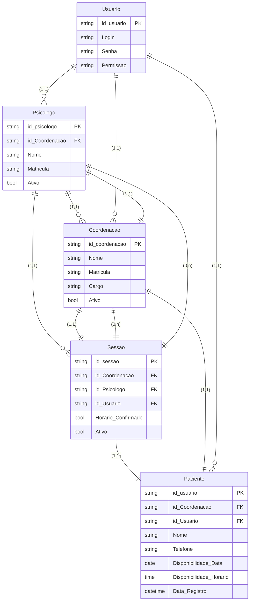

# Projeto_CIS_Rascunhos

# Dashboard Psicologia

**Description**: Sistema web interativo de gestão para psicólogos.

**Tech Stack**: Frontend: React + Javascript + Tailwind + Vite | Backend: Java + Spring boot | Auth: Spring Security | Banco : MySql

## Directory Structure
Frontend:
- `/src`: Código frontend
  - `/components`: Componentes React 
  - `/components`: `/calendar`: Calendar components (MonthlyCalendar.jsx, PotentialPatientsGrid.jsx)
  - `/components`: `/common`: Common components (Icons.jsx, PatientDetailSidebar.jsx)
  - `/components`:`/layouts`: Sidebar component (Sidebar.jsx)
  - `/data`: Dados mock (mockData.ts)
  - `/utils`: Definições (dataUtil.js)
  - `/view`: Dashboard overview (DashbooardView.jsx)
 
Backend:
- `/src` : codigo fonte
    - `/controller`: controllers de serviço
    - `/domain`: `/dtos` : todos os Dtos do sistema, dividido em request e response
    - `/domain`: `/dtos` :`/request`: esquemas de dtos de ponto de pedido http (entrada de dados)
    - `/domain`: `/dtos` :`/response`: esquemas de dtos de ponto de pedido http (saida de dados)
    - `/domain`: `/entity` : todos os esquemas de entidades
    - `/infra` : infraestrutura do sistema
    - `/infra`: `/cofig` : configurações e segurança
    - `/infra` : `/mapper` : logica de encapsulamento e transformação de dto(request) para entidade e entidade para dto (response)
    - `/infra` : `/repository` : repositorios das entidades e ponto de acesso ao banco
    - `/infra` : `/service` : camada de interface e implementação das interfaces para encapsular os metodos dos controllers
    - `/infra` : `/validate` : camada de validação para o fluxo de informação

### Limitações Conhecidas
- Não há autenticação de usuário

## Database Schema

| Entidade | Chaves/Atributos | Tipo de Dado | Descrição |
| :--- | :--- | :--- | :--- |
| **Psicologo** | `id_psicologo` (PK), `id_Coordenacao` (FK), `Nome`, `Matricula`, `Ativo` | `string`, `string`, `string`, `string`, `bool` | Profissional responsável pelo atendimento. |
| **Coordenacao** | `id_coordenacao` (PK), `Nome`, `Matricula`, `Cargo`, `Ativo` | `string`, `string`, `string`, `string`, `bool` | Responsável pela gestão/administração. |
| **Sessao** | `id_sessao` (PK), `id_Coordenacao` (FK), `id_Psicologo` (FK), `id_Usuario` (FK), `Horario_Confirmado`, `Ativo` | `string`, `string`, `string`, `string`, `bool`, `bool` | Registro de um agendamento/consulta. |
| **Paciente** | `id_usuario` (PK), `id_Coordenacao` (FK), `id_Usuario` (FK), `Nome`, `Telefone`, `Disponibilidade_Data`, `Disponibilidade_Horario`, `Data_Registro` | `string`, `string`, `string`, `string`, `string`, `date`, `time`, `datetime` | Dados do paciente. |
| **Usuario** | `id_usuario` (PK), `Login`, `Senha`, `Permissao` | `string`, `string`, `string`, `string` | Dados de acesso e autenticação do sistema. |

## Deno Functions
N/A

## API Endpoints
- `/dtoRequests`: entrada de dados json
    - `/coordenacao`:{"nome": "String",
                          "email": "String",
                          "matricula": "String"}
    - `/paciente`:{
                      "nome": "String",
                      "telefone": "String",
                      "idCoordenacao": 0, -->requer valido
                      "disponibilidadeData": "SEGUNDA", -->tipo enum
                      "disponibilidadeHorario": "H0800" -->ex h 08:00 }
    - `/psicologo`:{
  "nome": "string",
  "matricula": "string",
  "idCoordenacao": 0 --> requer valido
}
    - `/sessao`:{
  "idPsicologo": 0, --> requer valido
  "idPaciente":0, --> requer valido
  "idCoordenacao": 0, --> requer valido
  "dataHoraAgendada": "2025-12-02T07:02:21.376Z" --> hora de entrada de informação
}

- `/dtoResponses`: web view
    - `/coordenacao`:{
  "id": 0,
  "nome": "string",
  "matricula": "string",
  "email": "string"
}
    - `/paciente`:{
  "id": 0,
  "idCoordenacao": 0,
  "nome": "string",
  "telefone": "string"
}
    - `/psicologo`:{
  "id": 0,
  "idCoordenacao": 0,
  "nome": "string",
  "matricula": "string"
}
    - `/sessao`:{
  "id": 0,
  "idPaciente": 0,
  "idPsicologo": 0,
  "idCoordenacao": 0,
  "dataHora": "2025-12-02T07:05:20.772Z",
  "status": "PENDENTE_APROVACAO",
  "dataAprovacao": "2025-12-02T07:05:20.772Z"
}

## Futures Improvements
- Integrar com backend
- Adicionar sistema de autenticação para múltiplos psicólogos
- Exportar relatórios de sessões em PDF
- Sistema de lembretes por email/SMS
- Histórico de sessões com anotações
