# Projeto_CIS_Rascunhos

```mermaid
erDiagram
    Psicologo ||--o{ Coordenacao : "(1,1)"
    Coordenacao ||--|| Psicologo : "(1,1)"

    Psicologo ||--o{ Sessao : "(1,1)"
    Coordenacao ||--|| Sessao : "(1,1)"

    Sessao ||--|| Coordenacao : "(0,n)"
    Sessao ||--|| Psicologo : "(0,n)"
    Sessao ||--|| Paciente : "(1,1)"
    
    Coordenacao ||--|| Paciente : "(1,1)"
    
    Usuario ||--o{ Paciente : "(1,1)"
    Usuario ||--o{ Psicologo : "(1,1)"
    Usuario ||--o{ Coordenacao : "(1,1)"
    
    
    Psicologo {
        string id_psicologo PK
        string id_Coordenacao FK
        string Nome 
        string Matricula
        bool Ativo
    }

    Coordenacao {
        string id_coordenacao PK
        string Nome
        string Matricula
        string Cargo
        bool Ativo
    }

    Sessao {
        string id_sessao PK
        string id_Coordenacao FK
        string id_Psicologo FK
        string id_Usuario FK
        bool Horario_Confirmado
        bool Ativo
    }

    Paciente {
        string id_usuario PK
        string id_Coordenacao FK
        string id_Usuario FK
        string Nome
        string Telefone
        date Disponibilidade_Data
        time Disponibilidade_Horario
        datetime Data_Registro
    }

    Usuario {
        string id_usuario PK
        string Login
        string Senha
        string Permissao
    }
```

# C+S Psicologia

## 💡 Visão Geral do Projeto

### Contexto
Projeto de aplicação web voltado para os alunos de Psicologia da faculdade que estagiam dentro do campus e que ainda utilizam métodos lentos e arcaicos de controle de consulta.

* Ao invés de utilizarem PDFs com extensas listas com informações perdíveis e apagadas, criaremos um sistema de cadastro e disponibilidade.
* O sistema visa permitir que os estagiários selecionem os pacientes com mais eficiência.
* O(A) Coordenador(a) poderá manter um controle mais fácil e acessível dos futuros profissionais e seus pacientes, gerando relatórios mais rápidos.

### 🛠️ Ferramentas Usadas

| Camada | Tecnologia |
| :--- | :--- |
| **Frontend** | React + JavaScript + Tailwind + Vite |
| **Backend** | Java + SpringBoot |
| **Banco de Dados** | MySQL |
| **Autenticação** | Spring Security (a ser implementado) |

---

## 🎯 Objetivos

* Agilizar e aprimorar os processos de agendamento entre pacientes e psicólogos.
* Criar uma ferramenta prática para o dia-a-dia dos estagiários.
* Facilitar a visualização e criação de relatórios para os gestores.

---

## 📋 Especificações (Escopo)

O sistema deve incluir as seguintes funcionalidades:

* **Listagem de Pacientes:** Visualização da lista de pacientes em formato de cartelas (cards).
* **Disponibilidade:** Visualização da disponibilidade de horários também em cartelas.
* **Retorno de Pacientes Cadastrados:** Funcionalidade para buscar pacientes já registrados.
* **Métricas:** Exibição da quantidade de pessoas atendidas.
* **Relatórios:** Controle e facilitação na geração de relatórios para a coordenação.

---

## ⚠️ Problemas Atuais (Resolvidos pelo Projeto)

* A falta de comunicação entre os sistemas utilizado por eles.

## Directory Structure
Frontend:
- `/src`: Código frontend
  - `/components`: Componentes React
  - `/components`: `/calendar`: Calendar components (MonthlyCalendar.jsx, PotentialPatientsGrid.jsx)
  - `/components`: `/common`: Common components (Icons.jsx, PatientDetailSidebar.jsx)
  - `/components`:`/layouts`: Sidebar component (Sidebar.jsx)
  - `/data`: Dados mock (mockData.ts)
  - `/utils`: Definições (dataUtil.js)
  - `/view`: Dashboard overview (DashbooardView.jsx)
 
Backend:
- `/src` : codigo fonte
  - `/controller`: controllers de serviço
  - `/domain`: `/dtos` : todos os Dtos do sistema, dividido em request e response
  - `/domain`: `/dtos` :`/request`: esquemas de dtos de ponto de pedido http (entrada de dados)
  - `/domain`: `/dtos` :`/response`: esquemas de dtos de ponto de pedido http (saida de dados)
  - `/domain`: `/entity` : todos os esquemas de entidades
  - `/infra` : infraestrutura do sistema
  - `/infra`: `/cofig` : configurações e segurança
  - `/infra` : `/mapper` : logica de encapsulamento e transformação de dto(request) para entidade e entidade para dto (response)
  - `/infra` : `/repository` : repositorios das entidades e ponto de acesso ao banco
  - `/infra` : `/service` : camada de interface e implementação das interfaces para encapsular os metodos dos controllers
  - `/infra` : `/validate` : camada de validação para o fluxo de informação

### Limitações Conhecidas
- Não há autenticação de usuário

## Database Schema

| Entidade | Chaves/Atributos | Tipo de Dado | Descrição |
| :--- | :--- | :--- | :--- |
| **Psicologo** | `id_psicologo` (PK), `id_Coordenacao` (FK), `Nome`, `Matricula`, `Ativo` | `string`, `string`, `string`, `string`, `bool` | Profissional responsável pelo atendimento. |
| **Coordenacao** | `id_coordenacao` (PK), `Nome`, `Matricula`, `Cargo`, `Ativo` | `string`, `string`, `string`, `string`, `bool` | Responsável pela gestão/administração. |
| **Sessao** | `id_sessao` (PK), `id_Coordenacao` (FK), `id_Psicologo` (FK), `id_Usuario` (FK), `Horario_Confirmado`, `Ativo` | `string`, `string`, `string`, `string`, `bool`, `bool` | Registro de um agendamento/consulta. |
| **Paciente** | `id_usuario` (PK), `id_Coordenacao` (FK), `id_Usuario` (FK), `Nome`, `Telefone`, `Disponibilidade_Data`, `Disponibilidade_Horario`, `Data_Registro` | `string`, `string`, `string`, `string`, `string`, `date`, `time`, `datetime` | Dados do paciente. |
| **Usuario** | `id_usuario` (PK), `Login`, `Senha`, `Permissao` | `string`, `string`, `string`, `string` | Dados de acesso e autenticação do sistema. |

## API Endpoints
- `/dtoRequests`: entrada de dados json
  - `/coordenacao`:{"nome": "String",
                          "email": "String",
                          "matricula": "String"}
  - `/paciente`:{
                      "nome": "String",
                      "telefone": "String",
                      "idCoordenacao": 0, -->requer valido
                      "disponibilidadeData": "SEGUNDA", -->tipo enum
                      "disponibilidadeHorario": "H0800" -->ex h 08:00 }
  - `/psicologo`:{
  "nome": "string",
  "matricula": "string",
  "idCoordenacao": 0 --> requer valido
}
  - `/sessao`:{
  "idPsicologo": 0, --> requer valido
  "idPaciente":0, --> requer valido
  "idCoordenacao": 0, --> requer valido
  "dataHoraAgendada": "2025-12-02T07:02:21.376Z" --> hora de entrada de informação
}

  - `/dtoResponses`: web view
    - `/coordenacao`:{
  "id": 0,
  "nome": "string",
  "matricula": "string",
  "email": "string"
}
  - `/paciente`:{
  "id": 0,
  "idCoordenacao": 0,
  "nome": "string",
  "telefone": "string"
}
  - `/psicologo`:{
  "id": 0,
  "idCoordenacao": 0,
  "nome": "string",
  "matricula": "string"
}
  - `/sessao`:{
  "id": 0,
  "idPaciente": 0,
  "idPsicologo": 0,
  "idCoordenacao": 0,
  "dataHora": "2025-12-02T07:05:20.772Z",
  "status": "PENDENTE_APROVACAO",
  "dataAprovacao": "2025-12-02T07:05:20.772Z"
}

## Futures Improvements
- Integrar com backend
- Adicionar sistema de autenticação para múltiplos psicólogos
- Exportar relatórios de sessões em PDF
- Sistema de lembretes por email/SMS
- Histórico de sessões com anotações
