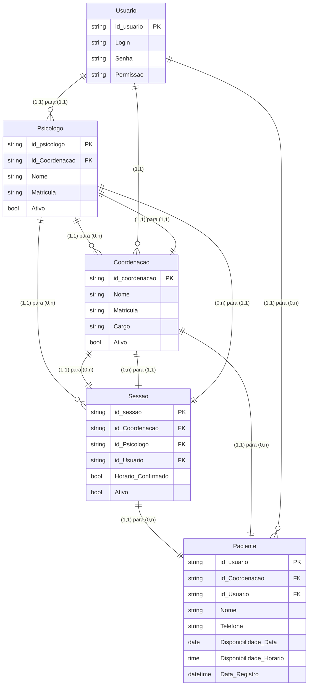

# Projeto_CIS_Rascunhos

# Dashboard Psicologia

**Description**: Sistema de gestão para psicólogos com calendário mensal interativo de horários disponíveis dos pacientes. Design amigável e colorido com interface responsiva.

**Tech Stack**: React + javascript + Vite | Backend: N/A | Auth: N/A

## Directory Structure
- `/src`: Código frontend
  - `/components`: Componentes React 
  - `/components`: `/calendar`: Calendar components (MonthlyCalendar.jsx, PotentialPatientsGrid.jsx)
  - `/components`: `/common`: Common components (Icons.jsx, PatientDetailSidebar.jsx)
  - `/components`:`/layouts`: Sidebar component (Sidebar.jsx)
  - `/data`: Dados mock (mockData.ts)
  - `/utils`: Definições (dataUtil.js)
  - `/view`: Dashboard overview (DashbooardView.jsx)

## Features and Future

### Implementado
1. **Sidebar de Navegação Esquerda**: Menu com 3 opções (Calendário Semanal, Meus Pacientes, Disponibilidade)
2. **Calendário Semanal Interativo**: Visualização de 7 dias com slots de horários (8h-18h), navegação entre semanas, destaque do dia atual, clique em horários para ver detalhes
3. **Lista de Pacientes**: Visualização em grid com busca, filtros (todos/ativos/inativos), cards coloridos com informações completas
4. **Gestão de Disponibilidade**: Interface para psicólogo configurar horários disponíveis/bloqueados por dia da semana
5. **Cards de Estatísticas**: 4 cards com métricas (Total de Pacientes, Pacientes Ativos, Agendamentos Pendentes, Taxa de Ativos)
6. **Sidebar Direita de Detalhes**: Painel lateral que aparece ao clicar em paciente/horário, mostrando sessões, contatos, próxima consulta, horários disponíveis
7. **Status de Agendamentos**: Visualização com cores (verde para confirmado, amarelo para pendente)
8. **Design Responsivo**: Layout de 3 painéis adaptável para mobile, tablet e desktop

### Limitações Conhecidas
- Dados são mock/estáticos (não há persistência real)
- Não há autenticação de usuário
- Disponibilidade não afeta calendário real

## Database Schema
**Type**: N/A (usando dados mock)

## Deno Functions
N/A

## API Endpoints
N/A (aplicação frontend pura com dados mock)

## Improvement Opportunities

### Alta Prioridade
- [ ] Adicionar filtros por status de agendamento (confirmado/pendente)
- [ ] Implementar sistema de notificações para consultas próximas
- [ ] Adicionar funcionalidade de criar/editar/deletar agendamentos

### Média Prioridade
- [ ] Integrar com backend real para persistência de dados
- [ ] Adicionar sistema de autenticação para múltiplos psicólogos
- [ ] Implementar visualização mensal do calendário

### Baixa Prioridade / Melhorias Futuras
- [ ] Exportar relatórios de sessões em PDF
- [ ] Sistema de lembretes por email/SMS
- [ ] Histórico de sessões com anotações
